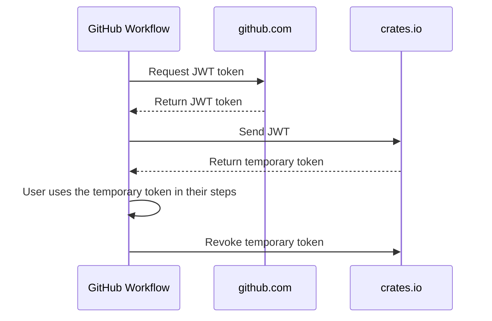

# crates-io-auth-action
test
Get a temporary access token to interact with crates.io using trusted publishing.

## Usage

This action retrieves a token from crates.io and sets it as an output variable.
You can read the token from the action's `token` output and use it in subsequent steps.
The action's `post` step automatically revokes the token when the job completes.

To learn how to use this action and configure your crates, read the
[crates.io documentation](https://crates.io/docs/trusted-publishing).

### Using a Different Registry URL

If you want to use a different URL than the default `https://crates.io`, you can specify it
in the `url` input.
For example, to use the crates.io staging environment:

```yaml
- name: Authenticate with custom registry
  id: auth
  uses: rust-lang/crates-io-auth-action@v1
  with:
    url: https://staging.crates.io
```

## Sequence Diagram



## License

This project is distributed under the terms of both the MIT license and the
Apache License (Version 2.0).

See [LICENSE-APACHE](LICENSE-APACHE) and [LICENSE-MIT](LICENSE-MIT) for details.
